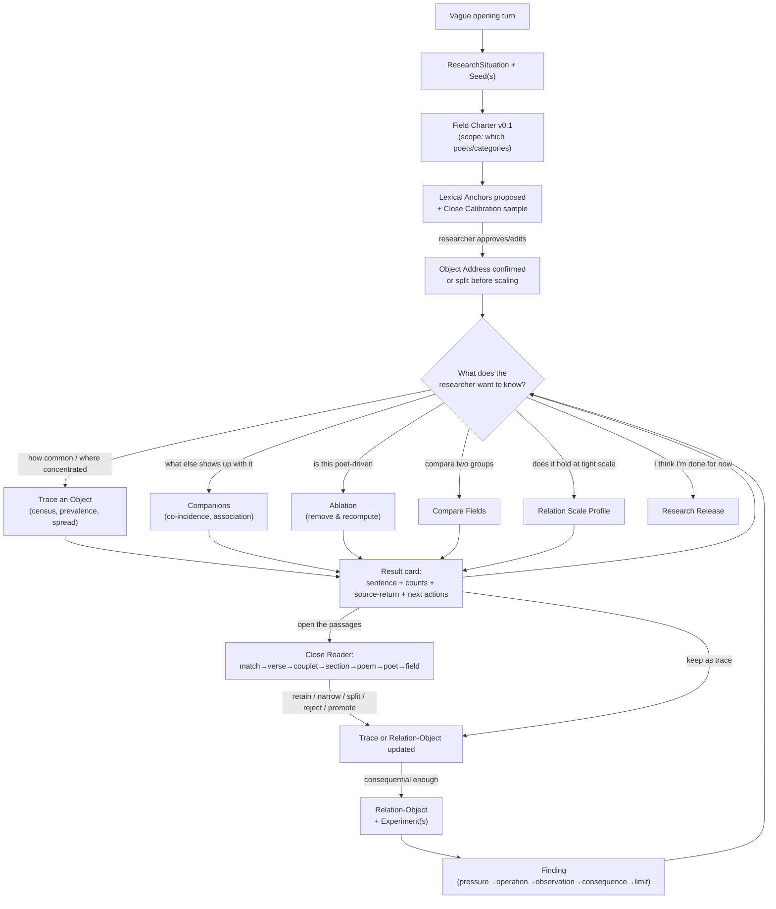

# The user journey — what actually happens in a session

This document answers one question concretely: when someone opens Claude
Code with the `persian-poetry-ontograph` skill installed and wants to
research something in the Ganjoor corpus, what actually happens, turn by
turn — how it starts, where it can branch, how the researcher knows what to
ask next, and exactly what an output looks like. It is the UX target the
implementation plan (`BUILD_PLAN.md`) and ledger (`IMPLEMENTATION_LEDGER.md`)
are built against; every example below cites the spec section it implements
(`../Ganjoor_Ontograph_Research_Apparatus_Project_Spec_v2.3.0.md`).

One running example carries the whole document — mirror (`آینه`) and rust
(`زنگار`) — the same example the spec itself uses in §45, so the worked
example and this journey describe the same territory from two directions:
the spec from the method's side, this document from the sitting-down-and-
typing side.

## 0. How it starts

The researcher does not run a command. They open Claude Code in a
directory holding (or pointing at) an `ontograph-workspaces/` tree and the
`persian-poetry-ontograph` skill, and they just say something — anything
from fully-formed to completely vague. Three real openings, three different
entry points into the same machinery:

> "I keep noticing mirrors and rust together in Hafez. Is that actually a
> thing or am I just noticing what I already believe?"

> "I want to look at how mirror imagery works across classical Persian
> poetry."

> "آینه" *(pastes a single word, nothing else)*

None of these name a Seed, a Field, an anchor, or a scale. That's the
point — the skill's job (spec §41, §61) is to turn any of the three into
the same first structured artifact without the researcher ever needing to
know the vocabulary in `references/terminology.md` exists yet.

### The onboarding turn

The skill asks a short, concrete set of questions — never the method's own
names for things, always the plain-language form (spec §41):

> - What are you following — one thing, like mirror, or a couple of things
>   at once?
> - Where should I look — everything, one poet, a handful of poets, a
>   particular form like ghazal?
> - Roughly how sure are you this is even a real pattern, versus a hunch
>   worth testing?

The researcher doesn't have to answer all three precisely. "Mirror, in
Hafez to start, pretty sure but I haven't checked" is enough. That turn
alone produces two records the researcher never sees as YAML but that now
exist on disk:

```yaml
# ResearchSituation (spec §6)
what_appeared: "mirror recurring with what feels like decay/rust in Hafez"
access_condition: "close reading, unsystematic"
why_it_matters: "researcher suspects a corpus-level convention, not proven"
first_question: "does mirror-rust recur beyond isolated passages, and where?"
uncertainty: "whether 'mirror' as a search string is even one object"

# SeedRecord (spec §8)
label: "mirror"
reason_for_following: "recurring material image the researcher noticed while reading"
uncertainty: "spelling variants, figurative vs. literal use unknown"
status: provisional
```

The agent says something like:

> Got it. I've opened a study (`mirror-in-hafez`) and logged why you're
> starting here. Before I can count anything, I need to pin down what
> counts as "mirror" in text — I'll propose the obvious spellings, you
> approve or edit them, then we'll spot-check a handful of real hits
> together before trusting any number. Sound right?

This is the first branch point: the researcher can say "yes, go" (fast
path), or "actually I also care about candle" (multi-Seed path, spec §7 —
each Seed gets its own Object Address in the same Field), or "wait, what do
you mean spot-check" (the agent explains calibration in one sentence and
proceeds).

## 1. The shape of a session from here



Nothing in this diagram is linear, and no box is mandatory. A researcher
can go straight from the onboarding turn to a Research Release five minutes
later ("never mind, just show me the raw numbers and let me leave") or can
spend three sessions in the `F` loop before ever creating a Relation-Object.
The loop has no privileged direction (spec §18) and neither does this
session.

## 2. How the researcher knows what to ask

This is the actual design answer, not a hand-wave — three concrete
mechanisms, all already required by the spec, all already assigned to a
specific file in the skill scaffold:

1. **The onboarding interview never requires vocabulary** (§41) — it asks
   "what are you following," not "define your Object Address."
2. **Every result card ends with an explicit menu of next actions**
   (§43 item 4) — the researcher is never asked to think of an operation
   name; they pick from what's offered, every single time, at every depth
   of the session. This is the load-bearing mechanism, not the onboarding
   interview — most turns *after* the first come from picking off this
   menu, not from typing a fresh request.
3. **A standing fallback** — the researcher can always ask "what else can
   I do here" or "what does that mean," and the agent answers from
   `references/operations.md` and `references/terminology.md` in plain
   language scoped to the current state (not the whole method at once).

Concretely, after almost any operation the closing lines look like this
(this exact shape recurs — it is `references/operations.md`'s sentence
templates in practice):

> Want me to: **(a)** open a few of these passages, **(b)** see what else
> commonly shows up with mirror, **(c)** check whether this holds at
> couplet scale instead of poem scale, or **(d)** compare Hafez against
> another poet?

## 3. Concrete outputs at each branch

### 3.1 Calibration (before any number is trusted)

```bash
ontograph calibrate mirror-in-hafez --object mirror --sample 30 --json
```

> I approved `آینه` and `آیینه` as anchors and pulled 30 sample hits —
> mixed across poems, including a few odd-looking ones. Here are 8 to look
> at together (not the top search results — a deliberately mixed sample,
> per §9). Of these: 6 look like a literal mirror in the scene, 1 is
> clearly figurative ("mirror of the heart"), 1 I can't tell without more
> context.
>
> **Calibration receipt** — sample_size: 30, strata: [poem-length tercile,
> section_type], seed: 20260827, unresolved_ambiguous: 1/8 shown.
>
> Keep `MIRROR` as one address for now and flag the figurative case as
> `ambiguous`, or split into "literal surface" vs. "figurative" before we
> count anything?

This is the first place the researcher sees the anchor-vs-object distinction
made concrete rather than asserted (§8.1) — they are looking at real text,
not being told a rule.

### 3.2 Trace an Object (§27)

```bash
ontograph census mirror-in-hafez --object mirror --json
ontograph map recurrence mirror-in-hafez --object mirror --unit poem --json
```

Result card (plain language first, per §43):

> `آینه` occurs in **41 of 495 eligible poems** (8.3%) in this field, under
> `assessed-full` mode — every hit was reviewed, not estimated. It's spread
> across **19 of Hafez's poems' categories**; the top single poem supplies
> only 4.9% of hits, so this isn't a fluke of one long poem.
>
> *(How was this made? unit=poem, denominator=495 eligible poems in field
> `mirror-in-hafez@v0.2`, mode=assessed-full, policy=`op-...-3`, engine
> v0.1.0.)*
>
> Open the passages, check dispersion (not just count), or see what shows
> up alongside mirror?

The underlying JSON the CLI actually returns (abbreviated) — this is what
the skill parses to build the sentence above, never the reverse:

```json
{
  "operation": "map_recurrence",
  "object_address": "mirror",
  "unit": "poem",
  "mode": "assessed-full",
  "field_version": "mirror-in-hafez@v0.2",
  "eligible_units": 495,
  "units_with_object": 41,
  "prevalence": 0.0828,
  "top_source_share": {"poem": 0.049, "category": 0.34},
  "operation_spec_id": "op-8f2c1a-3",
  "source_return_manifest": "mappings/map-7a1e/source-return.jsonl"
}
```

### 3.3 Companions (§28) — "what else shows up with it"

> `زنگار` (rust) co-occurs with mirror in **17 of 41** poem-scale units
> where mirror appears (P(rust|mirror) = 0.41), but mirror only shows up in
> 17 of rust's own 53 occurrences (P(mirror|rust) = 0.32) — the pull is
> stronger from rust's side than mirror's. That asymmetry is worth a look,
> not a causal claim (§28.2).
>
> Narrow this to couplet scale, or open the 17 shared poems first?

### 3.4 Relation Scale Profile (§29) — "does it hold at tight scale"

| Scale | shared units |
|---|---:|
| same poem | 17 |
| same section | 14 |
| same couplet | 9 |
| same verse | 4 |
| ±5 tokens | 2 |

> It thins fast — from 17 shared poems down to 9 shared couplets. Some of
> this pair's poem-level "co-occurrence" is two separate images in the
> same poem, not the same breath. Want the couplet-scale 9 and the
> poem-only 8 side by side to see what's actually different about them?

### 3.5 Ablation (§31) — "is this poet-driven"

> Removing Hafez from the field: mirror–rust couplet co-incidence drops
> from 9 to 2 (22% retention). This is strongly concentrated in Hafez
> under the current field — it does not tell us why, and it does not mean
> the relation is "just Hafez." Want to compare against Saadi specifically,
> or pull the 2 surviving non-Hafez cases for a close read?

### 3.6 Close Reader, at any point (§34–39)

Opening any number lands on real text, always with the full context ladder
available, never just the matched span:

> **Hafez, ghazal 3, couplet 4** (`hafez/ghazal/sh3`, section 0, verse
> order 7–8) — matched anchor `آینه` (normalized, no diacritic change).
>
> بشوی اوراق اگر همدرس مایی / که علم عشق در دفتر نباشد
> ...
>
> Zoom out to the full couplet · section · whole poem · Hafez's other
> mirror poems · the field. Pin this as a counterexample, a plain hit, or
> promote a new object (e.g. the cloth/dust doing the polishing)?

### 3.7 A Finding and a Relation-Object (§14, §16)

Once the researcher has looked at enough of this to say something, the
agent drafts — never asserts on its own — a Finding using the fixed grammar:

> **Draft finding:** *Pressure* — mirror-rust looked corpus-wide from the
> poem-scale count. *Operation* — ablation + scale profile. *Encounter* —
> removing Hafez collapses couplet-scale co-incidence to 22%. *Observation*
> — the tight-scale relation is real but concentrated in one poet under
> this field. *Consequence* — a field-wide claim is not warranted; a
> Hafez-specific one is. *Limit* — untested outside Hafez/Saadi's shared
> ghazal form.
>
> Save this, and turn mirror↔rust into a persistent Relation-Object so you
> can keep testing it across sessions?

### 3.8 Research Release (§42.10, §55, Appendix B)

> Here's your release package for `mirror-in-hafez` v0.1.0:
> `ontograph-workspaces/mirror-in-hafez/releases/v0.1.0/RELEASE.md` (plain-
> language summary + reopening conditions) and `release.json` (machine-
> replayable — Field Charter, every Object Address/anchor version, the
> calibration receipt, the full occurrence ledger, load-bearing Profiles,
> every Mapping Object with its source-return manifest, Traces, the
> Relation-Object above, this Finding, claim permissions, residue, and the
> data-licensing notice). Nothing here claims what mirror *is* — only what
> this inquiry established and where it can still be reopened.

The researcher gets these as real files in their workspace (and, in Claude
Code, can ask for them sent directly, same as any other output file — no
separate export step to learn).

## 4. What happens when the researcher asks for something out of scope

This matters as much as the supported paths. Two examples that should
happen exactly this way:

> **Researcher:** "So mirror really does symbolize the soul in Hafez,
> right? Can you say that in the release?"
>
> **Agent:** Not as an argued claim from what we have — companion co-
> incidence and a scale profile show a strong, poet-concentrated material
> relation, not a symbolic identity. I can write "mirror and rust show a
> tightly-scaled, Hafez-concentrated relation, plausibly read as material
> degradation and/or figurative for interior states (see the counterexample
> tray)" at `describe locally` permission. Arguing the symbolic reading
> needs a plural-description pass and probably a fourfold diagnostic
> (§12) first, if you want to go there.

> **Researcher:** "Just tell me how many times 'عشق' appears in the whole
> corpus."
>
> **Agent:** That's a lexical census, not object-level work — I can run it
> now (`anchor` mode, no calibration needed since you're not claiming
> object incidence). One question: do you want that field-wide, or scoped
> to something first? [proceeds directly if answered]

## 5. Cross-reference

Every numbered spec section cited above is implemented (or, for anything
still `todo`, targeted) by a specific ledger row in
`implementation/IMPLEMENTATION_LEDGER.md` — this document is the acceptance
criterion those rows are actually building toward, not a separate wish
list. If an implementation choice ever makes one of the concrete outputs
above impossible to produce, that's a bug in the implementation, not a
reason to quietly change this document.
